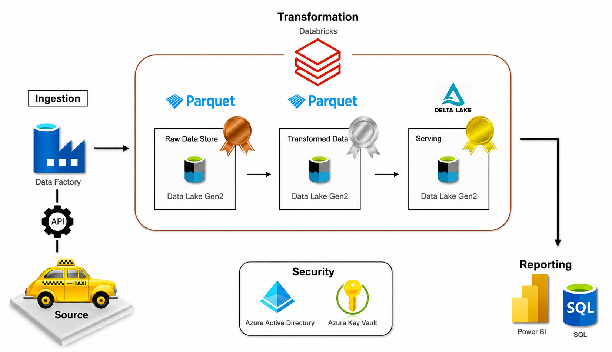

# 🚕 NYC Taxi Data Engineering Project



## 📖 Project Overview

This project demonstrates an **end-to-end Azure Data Engineering Pipeline** built using the **Medallion Architecture (Bronze, Silver, and Gold Layers)**.

The pipeline ingests NYC Taxi datasets using **Azure Data Factory**, stores raw data in **Azure Data Lake Storage Gen2**, performs transformations using **Azure Databricks and PySpark**, and creates analytics-ready datasets using **Delta Lake** for reporting and business intelligence.

---

## 🚀 Project Highlights

✅ End-to-End Azure Data Engineering Pipeline

✅ Medallion Architecture (Bronze → Silver → Gold)

✅ Azure Data Factory Data Ingestion

✅ Azure Data Lake Storage Gen2

✅ Azure Databricks & PySpark Transformations

✅ Azure Key Vault Integration

✅ Databricks Secret Scope Configuration

✅ Delta Lake Implementation

✅ ACID Transactions

✅ Time Travel & Data Versioning

✅ Analytics-Ready Data for Reporting

---

# 🏗️ Architecture

## Data Flow

```text
Source Data
     │
     ▼
Azure Data Factory
     │
     ▼
ADLS Gen2 (Bronze Layer)
     │
     ▼
Azure Databricks (Silver Layer)
     │
     ▼
Delta Lake (Gold Layer)
     │
     ▼
Power BI Reporting
```

---

## 🛠️ Technologies Used

| Technology                   | Purpose                   |
| ---------------------------- | ------------------------- |
| Azure Data Factory           | Data Ingestion            |
| Azure Data Lake Storage Gen2 | Data Storage              |
| Azure Databricks             | Data Processing           |
| PySpark                      | Data Transformation       |
| Delta Lake                   | Data Management           |
| Azure Key Vault              | Secret Management         |
| Service Principal            | Secure Authentication     |
| Power BI                     | Reporting & Visualization |

---

# 🥉 Bronze Layer - Data Ingestion

## Objective

Store raw datasets exactly as received from the source system.

## Process

1. Source NYC Taxi datasets are collected.
2. Azure Data Factory pipelines ingest the data.
3. Raw files are stored in Azure Data Lake Storage Gen2.
4. Data remains unchanged for audit and reprocessing purposes.

## Bronze Storage Structure

```text
bronze/
│
├── Taxi-Trip-Data-2025/
├── trip_type/
└── trip_zone/
```

## Benefits

* Preserves raw source data
* Supports data lineage
* Enables reprocessing when required
* Maintains source-of-truth datasets

---

# 🔐 Security Layer

## Azure Key Vault

Sensitive credentials are securely stored in Azure Key Vault:

* Client ID
* Client Secret
* Tenant ID

## Databricks Secret Scope

Secrets are accessed securely inside Databricks notebooks.

```python
secret_key = dbutils.secrets.get("my_scope", "secret-key")
client_id = dbutils.secrets.get("my_scope", "client-id")
tenant_id = dbutils.secrets.get("my_scope", "tenant-id")
```

## Benefits

* No hardcoded credentials
* Centralized secret management
* Secure authentication to Azure Storage
* Improved security and governance

---

# 🥈 Silver Layer - Data Transformation

## Objective

Transform, clean, and standardize raw datasets for analytics.

### Trip Type Dataset

Transformations:

* Renamed columns
* Standardized schema

```python
df_trip_type = df_trip_type.withColumnRenamed(
    "description",
    "trip_description"
)
```

---

### Trip Zone Dataset

Transformations:

* Split zone field into separate attributes
* Improved reporting usability

```python
df_trip_zone = df_trip_zone \
    .withColumn("zone1", split(col("zone"), "/")[0]) \
    .withColumn("zone2", split(col("zone"), "/")[1])
```

---

### Taxi Trip Dataset

Transformations:

* Applied predefined schema
* Standardized data types
* Converted timestamp fields
* Performed data validation

```python
df_trip = spark.read.format("parquet") \
    .schema(myschema) \
    .load(bronze_path)
```

---

## Silver Storage Structure

```text
silver/
│
├── trip_type/
├── trip_zone/
└── trip_data/
```

## Benefits

* Improved data quality
* Consistent schema
* Analytics-ready datasets
* Faster downstream processing

---

# 🥇 Gold Layer - Business Layer

## Objective

Create curated business-ready datasets optimized for reporting and analytics.

## Storage Format

**Delta Lake**

### Example

```python
df_zone.write.format("delta") \
    .mode("append") \
    .option("path", gold_path) \
    .saveAsTable("gold.trip_zone")
```

---

# ⚡ Delta Lake Features Implemented

## ACID Transactions

```sql
UPDATE gold.trip_zone
SET Borough = 'EMR'
WHERE LocationID = 1;
```

## Delete Operations

```sql
DELETE FROM gold.trip_zone
WHERE LocationID = 1;
```

## Time Travel

```sql
RESTORE gold.trip_zone
TO VERSION AS OF 2;
```

## History Tracking

```sql
DESCRIBE HISTORY gold.trip_zone;
```

---

## Benefits of Delta Lake

* Reliable transactions
* Data versioning
* Historical recovery
* Improved governance
* Better performance for analytics

---

# 📊 Reporting Layer

## Tools Used

* Power BI
* SQL Analytics

## Business Insights

The Gold Layer serves as the trusted source for analytics and reporting.

Typical insights include:

* Trip Volume Analysis
* Revenue Trends
* Pickup & Drop-off Analysis
* Borough-wise Performance
* Zone-wise Demand Analysis

---

# 📁 Repository Structure

```text
NYC-Taxi-Data-Engineering/
│
├── silver_notebook.ipynb
├── gold_notebook.ipynb
├── architecture-diagram.png
└── README.md
```

---

# ▶️ How to Run

### Step 1: Data Ingestion

Run Azure Data Factory pipelines to ingest source data into ADLS Gen2.

### Step 2: Configure Security

* Create Azure Key Vault
* Store Client ID, Client Secret, and Tenant ID
* Create Databricks Secret Scope

### Step 3: Execute Silver Layer

Run:

```text
silver_notebook.ipynb
```

This notebook performs data cleansing and transformations.

### Step 4: Execute Gold Layer

Run:

```text
gold_notebook.ipynb
```

This notebook creates Delta Lake tables for analytics.

### Step 5: Reporting

Connect Power BI to Gold Layer datasets and create dashboards.

---

# 🎯 Key Learning Outcomes

* Azure Data Factory Orchestration
* Azure Data Lake Storage Gen2
* Azure Databricks & PySpark
* Azure Key Vault Integration
* Databricks Secret Scopes
* Service Principal Authentication
* Medallion Architecture
* Delta Lake Implementation
* ACID Transactions
* Time Travel & Versioning
* End-to-End Data Engineering Pipeline

---

# 👨‍💻 Author

**Harikrishna Patel**

Azure Data Engineering Project – NYC Taxi Analytics Platform
